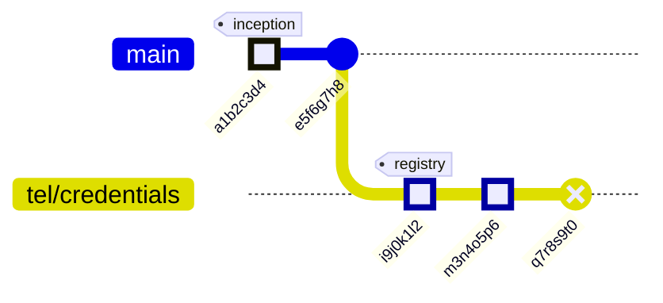

# KERI Graph Package

Self-contained graph generation from KERI data structures. Converts KEL/TEL events to various graph formats.

## KeriGitGraph

Converts KERI event chains to Mermaid gitGraph format for visualization.

### Usage

```typescript
import { createKeriGitGraph } from './app/graph';
import { createKerStore } from './storage/core';

const store = createKerStore(kv);
const graph = createKeriGitGraph(store);

// Generate Mermaid gitGraph
const mermaid = await graph.toMermaid({
  includeTel: true,              // Include TEL events
  includeCredentials: true,      // Include credential events
  filterAid: 'specific-aid',     // Optional: filter to specific AID
  filterRegistryId: 'reg-id',    // Optional: filter to specific registry
});

console.log(mermaid);
```

### React Component Example

```tsx
// app/components/Mermaid.tsx (Next.js) or src/components/Mermaid.tsx
"use client";
import { useEffect, useId, useRef } from "react";
import mermaid from "mermaid";

type Props = { chart: string };

export default function Mermaid({ chart }: Props) {
  const id = useId().replace(/:/g, "_");
  const containerRef = useRef<HTMLDivElement>(null);

  useEffect(() => {
    mermaid.initialize({ startOnLoad: false, securityLevel: "strict" });
    const render = async () => {
      const { svg } = await mermaid.render(id, chart);
      if (containerRef.current) containerRef.current.innerHTML = svg;
    };
    render();
  }, [chart, id]);

  return <div ref={containerRef} />;
}
```

### Using with React

```tsx
import { useState, useEffect } from 'react';
import { createKeriGitGraph } from '@/lib/keri/graph';
import Mermaid from '@/components/Mermaid';

export function KeriEventGraph({ store }) {
  const [chart, setChart] = useState('');

  useEffect(() => {
    const loadGraph = async () => {
      const graph = createKeriGitGraph(store);
      const mermaid = await graph.toMermaid({ includeTel: true });
      setChart(mermaid);
    };
    loadGraph();
  }, [store]);

  return <Mermaid chart={chart} />;
}
```

## Output Format

The KeriGitGraph generates Mermaid gitGraph syntax like:



## Event Mapping

| KERI Event | Git Representation | Visual Style |
|------------|-------------------|--------------|
| ICP (Inception) | Initial commit | HIGHLIGHT + "inception" tag |
| ROT (Rotation) | Commit | HIGHLIGHT + "rotation-N" tag |
| IXN (Interaction) | Commit | NORMAL |
| VCP (Registry) | Branch + commit | HIGHLIGHT + "registry" tag |
| ISS (Issuance) | Commit | HIGHLIGHT |
| REV (Revocation) | Commit | REVERSE |

## Branch Structure

- KEL events → Branch named after account alias
- TEL events → Branch named `tel/{registry-alias}`
- Each event → Git-style commit with truncated SAID as commit ID
